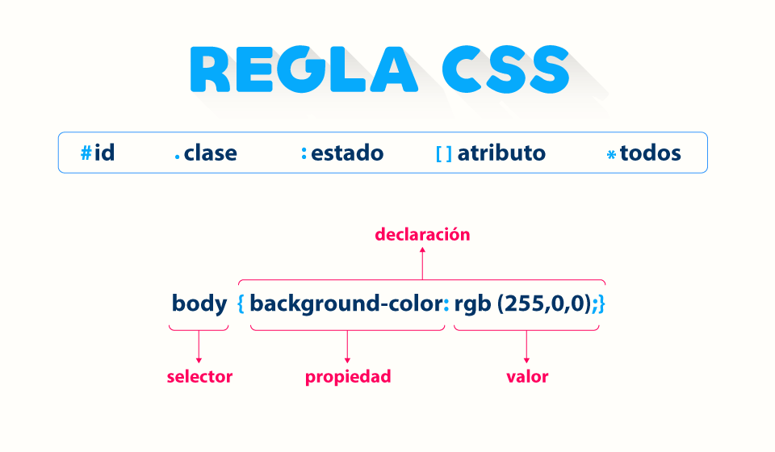
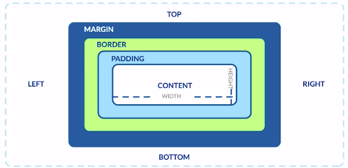
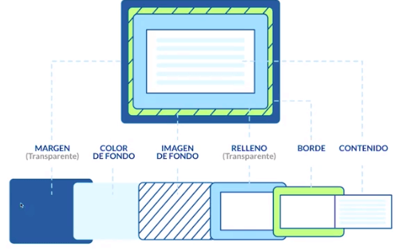

## Modelo de caja





## Margin:

> Es el espacio de la caja hacia afuera

## Border:

> Es el atributo del borde, el contorno de la caja

## Padding:

> Es un espacio de la caja hacia adentro, para ordenar mejor

### Content:

> Comprende el alto y ancho de la caja

### Calc

> Hay una forma de hacer que CSS calcule el tamaño de un elemento restandole cierta cantidad (width o height). Imagina que quieres colocar 2 cajas dentro de una caja padre y quieres que cada una tome el 50% del ancho, pero cada caja tenga un margen a la izquierda de 10px.

> Si colocas el 50% de la caja y ademas colocas el margen, esto hará que las cajas queden una encima de otra, por lo que se estan agregando 20 px al contenido y ya no se ajustará al 50% cada elemento

```
.caja-hijo{
width: calc(50% -20px);
}
```

#### Se le coloca 20px porque estamos aumentado un padding-;eft de 10px a cada elemento, como son 2, entonces se aumenta 20px al content
