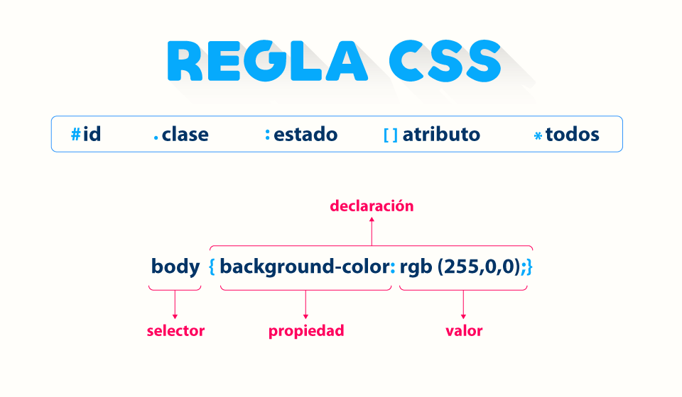
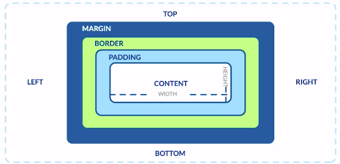
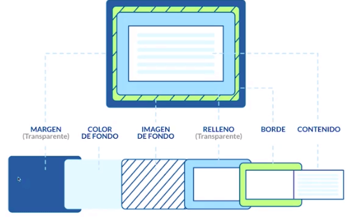

## URLS

- [Game: CSS Dinner](https://flukeout.github.io/)
- [Game: Garden](https://cssgridgarden.com/#es)
- [Game: Froggy](https://flexboxfroggy.com/#es)
- [Color Hunt](https://colorhunt.co/)
- [icons](https://iconos8.es/)
- [Picular](https://picular.co/Video)
- [Colors](https://coolors.co/)
- [Gradient](https://cssgradient.io/gradient-backgrounds/)
- [Flexbox](https://css-tricks.com/snippets/css/a-guide-to-flexbox/)
- [Grid](https://css-tricks.com/snippets/css/complete-guide-grid/)
- [Stylus](https://stylus-lang.com/)
- [Sass](https://sass-lang.com/guide)
- [Experiments](https://labs.jensimmons.com/)



## Modelo de caja





### Margin:

> Es el espacio de la caja hacia afuera

### Border:

> Es el atributo del borde, el contorno de la caja

### Padding:

> Es un espacio de la caja hacia adentro, para ordenar mejor

### Content:

> Comprende el alto y ancho de la caja

### Calc

> Hay una forma de hacer que CSS calcule el tamaño de un elemento restandole cierta cantidad (width o height). Imagina que quieres colocar 2 cajas dentro de una caja padre y quieres que cada una tome el 50% del ancho, pero cada caja tenga un margen a la izquierda de 10px.

> Si colocas el 50% de la caja y ademas colocas el margen, esto hará que las cajas queden una encima de otra, por lo que se estan agregando 20 px al contenido y ya no se ajustará al 50% cada elemento

```
.caja-hijo{
width: calc(50% -20px);
}
```

- Se le coloca 20px porque estamos aumentado un padding-;eft de 10px a cada elemento, como son 2, entonces se aumenta 20px al content

### RESETEAR EL ESTILO DE LA PAGINA

```
*{
  box-sizing: border-box;
  padding: 0;
  margin: 0;
}

html{
  font-size: 62.5%;
}
```

## Especificidad

> Es la gerarquía que tienen las diferentes asignaciones de estilo en CSS

| Tipo                           | Caracteristica                                                                                                   |
| ------------------------------ | ---------------------------------------------------------------------------------------------------------------- |
| !important                     | Se coloca sin importar el resto de estilos, este es el de mayor gerarquía (evitar usarlo)                        |
| css inyectado en etiqueta HTML | Se aplicará sin importar el resto de CSS excepto si existe un !important (evitar usarlo)                         |
| id                             | Los id se aplican si no existe un css inyectado en una etiquta HTML y si no existe un !important (evitar usarlo) |
| clases                         | Las clases se aplican si lo anterior no existe en el CSS, si se quiere aplicar CSS se debe aplicar con clases    |
| etiqueta                       | Las etiquetas son de menor gerarquía, se aplican si no existen clases                                            |

## [Combinadores](https://developer.mozilla.org/en-US/docs/Learn/CSS/Building_blocks/Selectors/Combinators)

| Tipo                          | Caracteristica                                                    |
| ----------------------------- | ----------------------------------------------------------------- |
| h2 + p {} (hermano adyacente) | aplica la propiedad si p sigue despues de h2                      |
| h2 + p {} (hermano general)   | Aplica la propiedad siempre y cuando p este al mismo nivel que h2 |
| div > p {} (hijo directo)     | si p es hijo directo de div, aplicale el estilo                   |
| div p {} (desenciente)        | Si dentro de un div existe un p, aplicale este estilo             |

## Medidas

- Relativas

  > Las medidas relativas si cambian

- Absolutas
  > Son una medida que no va a cambiar

| Absolutas | Relativas            |
| --------- | -------------------- |
| px        | %                    |
|           | em                   |
|           | rem(root em)         |
|           | max-width/max-height |
|           | min-width/min-height |
|           | vw (viewport width)  |
|           | vh (viewport height) |

> em: Es una relativa que toma el tamaño de fuente de su padre directo

> rem: Siempre toma el valor de la etiqueta root osea la etiqueta HTML

> width: Será el tamaño de referencia para usar

- min-width
  > indica el tamaño minimo que tendrá un elemento
- max-width

  > es el tamaño maximo que tendra un elemento

- min-height:
  > es para que el elemento tenga un tamaño minimo pero si el contenido supera ese tamaño, entonces crecerá con el contenido el tamaño del eelemento
